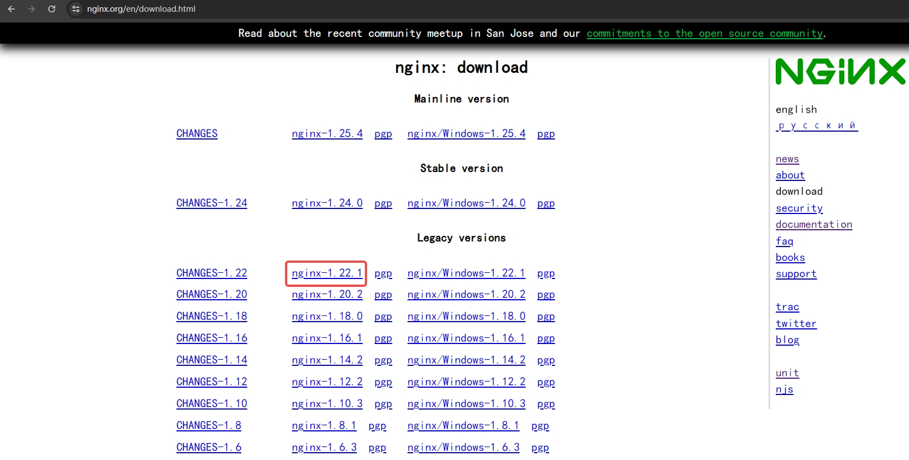

# Ubuntu安装 nginx-1.18.0

> 在下图中的网站下载nginx源码:  
>   

> 创建系统用户:  
> useradd -r nginx -s /sbin/nologin  

> 环境依赖(pcre,openssl,zlib):  
> apt-get update && apt-get install build-essential libpcre3 libpcre3-dev  \  
>     zlib1g zlib1g-dev libssl-dev libgeoip-dev libperl-dev gdb  
> 如果以上的依赖库版本不支持当前nginx版本, 则安装指定的依赖库版本后, 按照以下方式进行编译:  
> 启用外部模块: --add-module=path  
> 启用外部动态模块: --add-dynamic-module=path  
> 启用pcre模块: --with-pcre=path  
> 设置openssl库源路径: --with-openssl=path 

> 构建:
> tar -xf nginx-1.18.0.tar.gz && cd nginx-1.18.0 && mkdir /usr/local/nginx-1.18.0     
> ./configure --prefix=/usr/local/nginx-1.18.0 \  
>             --user=nginx \  
>             --group=nginx \  
>             --with-select_module \  
>             --with-poll_module \  
>             --with-file-aio \  
>             --with-http_ssl_module \  
>             --with-http_v2_module \  
>             --with-http_geoip_module \  
>             --with-http_gunzip_module \  
>             --with-http_gzip_static_module \  
>             --with-http_auth_request_module \  
>             --with-http_slice_module \  
>             --with-http_stub_status_module \  
>             --with-http_perl_module=dynamic \  
>             --with-perl_modules_path=/usr/local/nginx-1.18.0/perls \  
>             --with-mail=dynamic \  
>             --with-mail_ssl_module \  
>             --without-mail_smtp_module \  
>             --with-stream=dynamic \  
>             --with-stream_ssl_module \  
>             --with-stream_geoip_module=dynamic \  
>             --with-cpp_test_module \  
>             --with-debug  

 
> nginx常用操作  
> 平滑重启: nginx -s reload  
> 平滑升级:  
>  1. 备份旧版nginx相关文件  
>  2. 获取旧版nginx服务的编译参数: nginx -V
>  3. 用旧版nginx的编译参数编译, 然后用编译的新版nginx二进制文件替换旧版nginx二进制文件(编译时不执行make install)   
>  4. 检查nginx的配置文件是否有错: nginx -t -c nginx.conf  
>  5. 重启nginx: nginx -s reload  

> 使用系统apt包管理器安装时的默认参数:  
> ./config --with-cc-opt='-g -O2 -ffile-prefix-map=/build/nginx-zctdR4/nginx-1.18.0=. -flto=auto-ffat-lto-objects -flto=auto-ffat-lto-objects -fstack-protector-strong -Wformat -Werror=format-security -fPIC -Wdate-time -D_FORTIFY_SOURCE=2' \  
        --with-ld-opt='-Wl,-Bsymbolic-functions -flto=auto -ffat-lto-objects -flto=auto -Wl,-z,relro -Wl,-z,now -fPIC' \  
        --prefix=/usr/share/nginx \  
        --conf-path=/etc/nginx/nginx.conf \  
        --http-log-path=/var/log/nginx/access.log \  
        --error-log-path=/var/log/nginx/error.log \  
        --lock-path=/var/lock/nginx.lock \  
        --pid-path=/run/nginx.pid \  
        --modules-path=/usr/lib/nginx/modules \  
        --http-client-body-temp-path=/var/lib/nginx/body \  
        --http-fastcgi-temp-path=/var/lib/nginx/fastcgi \  
        --http-proxy-temp-path=/var/lib/nginx/proxy \  
        --http-scgi-temp-path=/var/lib/nginx/scgi \  
        --http-uwsgi-temp-path=/var/lib/nginx/uwsgi \  
        --with-compat \  
        --with-debug \  
        --with-pcre-jit \  
        --with-http_ssl_module \  
        --with-http_stub_status_module \  
        --with-http_realip_module \  
        --with-http_auth_request_module \  
        --with-http_v2_module \  
        --with-http_dav_module \  
        --with-http_slice_module \  
        --with-threads \  
        --add-dynamic-module=/build/nginx-zctdR4/nginx-1.18.0/debian/modules/http-geoip2 \  
        --with-http_addition_module \  
        --with-http_gunzip_module \  
        --with-http_gzip_static_module \ 
        --with-http_sub_module  

> linux内核参数优化(sysctl -p /etc/sysctl.d/10-nginx.conf)  
> 将以下参数写入/etc/sysctl.d/10-nginx.conf  
> net.core.netdev_max_backlog = 262144  
> net.core.somaxconn = 262144  
> net.ipv4.tcp_max_orphans = 262144  
> net.ipv4.tcp_max_syn_backlog = 262144  
> net.ipv4.tcp_timestamps = 0  
> net.ipv4.tcp_synack_retries = 1  
> net.ipv4.tcp_syn_retries = 1  
