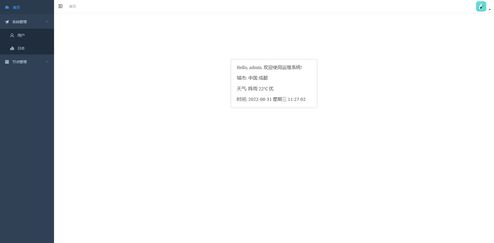
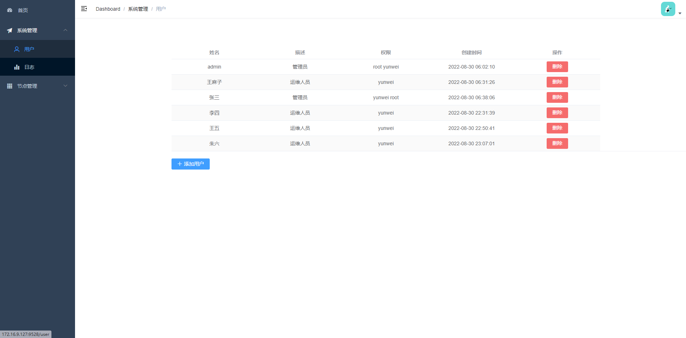
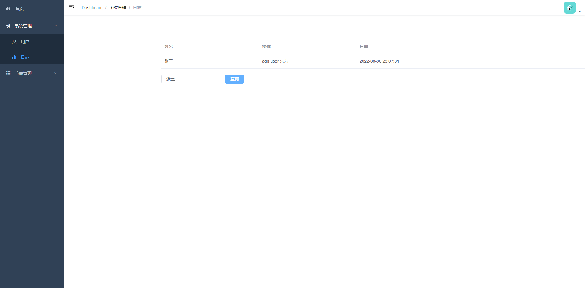
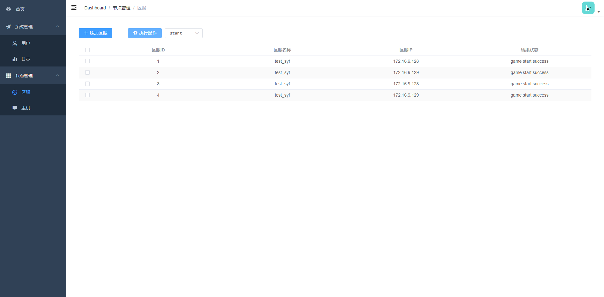
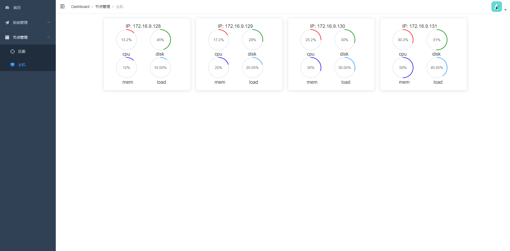

# GameOm


* *说明*
```
  - 多服游戏运维web工具
  - web后端: fastapi + fabric
  - web前端: vue-admin-template
  - 运维服+游戏服的模式(运维服添加一个用户可以免密登录到游戏服)
```

* *部署*
```
  1. centos7 + python3.9
  2. 推荐使用pyenv安装python指定版本，具体参考: https://github.com/pyenv/pyenv
  3. 推荐使用pipenv创建虚拟环境: python3.9 -m pip install pipenv && pipenv shell
  4. 安装依赖: pipenv install -r requirements.txt
  5. 更新配置: app/config.py
  6. 数据库依赖mongodb, 启动一个mongodb实例, 并配置app/config.py中数据库信息
  7. 使用免登录用户启动: sh manage.sh start
  8. 将tools路径下的nodeinfo工具部署到游戏服的/usr/bin目录下
```

* *截图*
* 
* 
* 
* 
* 