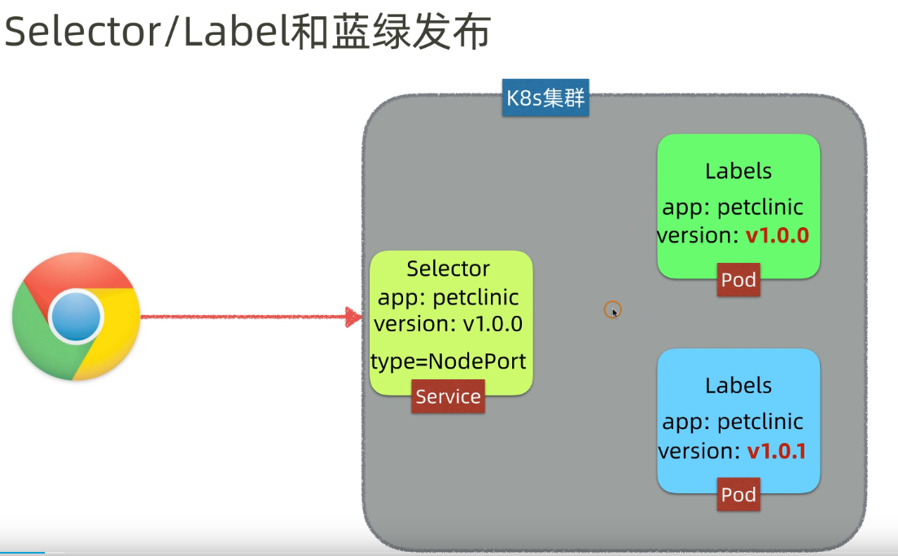

### k8s

* **k8s架构**
  * *master节点*
  ```
    - kube-apiserver
    - kube-scheduler
    - controller-manager
    - etcd
  ```
  * *node节点*
  ```
    - kubelet
    - kube-proxy
    - container runtime
    - 插件(addons)
    - ...
  ```

* **发布资源**
  * kubectl apply -f test.yml
  * kubectl apply -f dirname

* **k8s资源对象**
  * *Service*
    * *蓝绿发布*
    <!--  -->
    * *NodePort*
    <!--  -->
    * *ClusterIP*
    <!--  -->
    * *LoadBalancer*
  * *Pod*
    <!--  -->
  * *ReplicaSet*
    <!--  -->
  * *Deployment*
  * *Namespace*
    <!--  -->
  * *ConfigMap*
    <!--  -->
  * *Secret*
    <!--  -->
  
  * *ReplicationController*
  * *HorizontalPodAutoscaler*
  * *StatefulSet*
  * *PersistentVolume*
