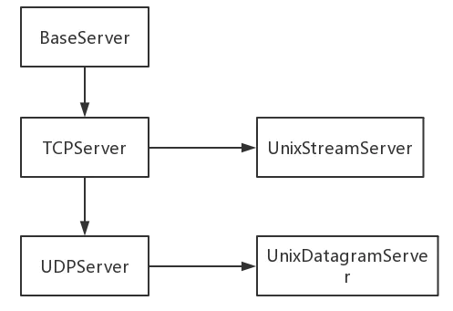

## ***socketserver***


* *说明*
>  - socketserver是python中内置的一个基于四种基本流以及异步的网络处理框架
>    1. TCPServer -> TCP套接字
>    2. UDPServer -> UDP套接字
>    3. UnixStreamServer -> unix域套接字
>    4. UnixDatagramServer -> unix域套接字

<!-- >     -->
>  - 继承关系:    
>    BaseServer    
>       ↓  
>    TCPServer  ->  UnixStreamServer    
>       ↓   
>    UDPServer  ->  UnixDatagramServer    

>  - 异步处理请求:    
>    1 ForkingMixln -> 多进程实现异步    
>    2 ThreadingMixln -> 多线程实现异步    

>    使用socketserver框架可以快速开发出性能还不错的server&&client架构的网络应用服务。
>    要保证数据在传输过程中安全可靠，还要实现通信协议，以及数据加密等。

* *示例*
```
    import socketserver


    class MyServer(socketserver.BaseRequestHandler):
        def handle(self) -> None:
            pass


    class MyTcpServer(socketserver.StreamRequestHandler):
        def handle(self) -> None:
            pass


    class MyUdpServer(socketserver.DatagramRequestHandler):
        def handle(self) -> None:
            pass


    if __name__ == '__main__':
        address = ('localhost', 5000)
        server = socketserver.ThreadingTCPServer(address, MyTcpServer)
        # server = socketserver.ThreadingUDPServer(address, MyUdpServer)

        server.serve_forever()
```
